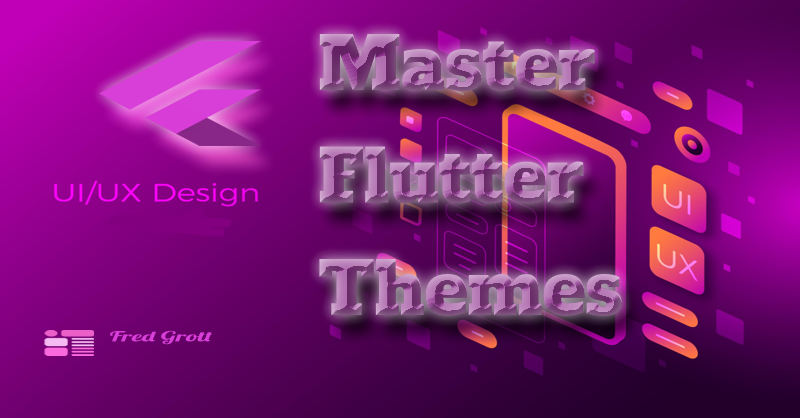

# Master Flutter Themes

</iframe>

My substack is here:

https://fredgrott.substack.com

## Can I Re-Use This Code

Yes, the code is under BSD-clause 3 license and ready for you to modify and re-use.
